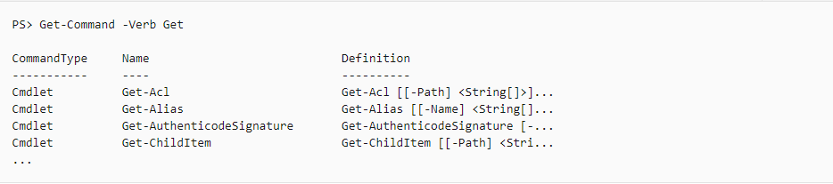

<h1>5. Desenvolvimento</h1>

<h5 style="margin-left:25px">5.0 Powershell</h5>

Ao contrário de interfaces de linha de comando tradicionais, os cmdlets
do PowerShell são projetados para lidar com objetos. Um objeto
representa informações estruturadas que vão além da uma cadeia de
caracteres exibida na tela. A saída do comando sempre acompanha
informações extras que poderão ser usadas quando necessário.

Quando você digita um comando, o PowerShell sempre processa a linha de
comando de entrada diretamente, ele também formata a saída exibida na
tela, essa diferença é considerável porque reduz o trabalho necessário
em cada cmdlet. Isso garante que você possa fazer as coisas sempre da
mesma maneira com qualquer cmdlet. Os desenvolvedores de cmdlet não
precisam escrever códigos para analisar os argumentos de linha de
comando ou formatar a saída.

o parâmetro **-?** sempre significa \"mostre-me a Ajuda para este
comando\".

O cmdlet, por ter comandos grandes, trabalha com verbos em inglês, então
a memorização fica bem fácil

Você pode listar todos os comandos que incluem um determinado verbo com
o parâmetro **Verb** para Get-Command. Por exemplo, para ver todos os
cmdlets que usam o verbo Get

por exemplo, para desligar o computador pelo powershell, é
Stop-Computer.

Outros comandos no Powershell, como listagem de arquivos etc segue o
padrão Linux, exemplo

cd

ls

ps

kill

clear

Documentação
Powwershell:[[https://docs.microsoft.com/pt-br/powershell/scripting/learn/understanding-important-powershell-concepts?view=powershell-7]{.underline}](https://docs.microsoft.com/pt-br/powershell/scripting/learn/understanding-important-powershell-concepts?view=powershell-7)

5.1 WSL no Windows

WSL é um recurso relativamente recente, no qual integra o kernel Linux
juntamente com o Windows de forma nativa e oficial

Para ativar o recuso é bem simples, basta pesquisar no Windows 10 por
"Ativar ou desativar recursos do Windows" e pressionar enter

Após isso, abaixe pela barra de navegação
e procure pela seguinte opção:

Após isso, basta ir na loja da Microsoft e pesquisar pela sua distro, depois, basta iniciar pela própria loja. 

<h5 style="margin-left:25px">5.1 Chocolatey</h5>

Chocolatey em resumo é um gerenciador de pacotes para Windows, ele foi projetado para ser uma estrutura decentralizada para instalar aplicativos(como se fosse um apt). O Chocolatey é construido pela infraestrutura do NuGet que usa o Powershell. 

Por ser um instalador de pacotes, é necessário iniciar seu Prompt de Comando em modo administrador. 
Principais comandos: 
choco seach "pacote" -> busca por um pacote e versões dele 
choco install "pacote" -> instala um aplicativo 
choco install "pacote" "pacote1" -> instala mais de 1 pacote.(pode ser colado mais de 2) 
choco uninstall "pacote" -> desinstala algum aplicativo 
choco list -localonly -> lista todos os pacotes que foram instalados no computador via choco 
choco upgrade "pacote" -> para atualizar a versão 

Caso você não queira usar terminal, é possível utilizar o choco de forma gráfica 
choco install ChocolateyGUI 

Para instalar o Chocolatey,você pode acessar a documentação oficial do programa através desse link [https://chocolatey.org/install#individual]
